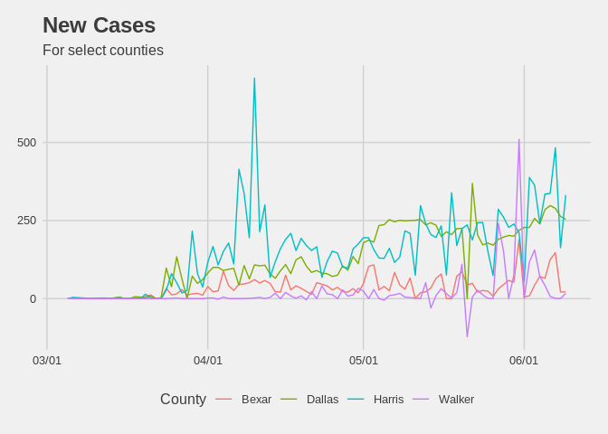
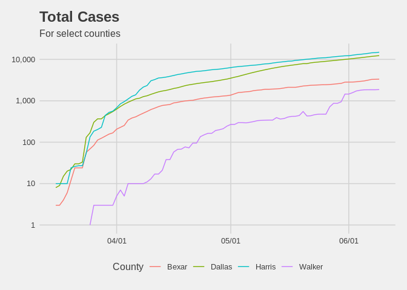

## Summary 
Daily publication of cleaned and tidy Texas county-level Covid-19 statistics, as published by Texas DSHS.\
Original data sourced from <https://www.dshs.state.tx.us/coronavirus/additionaldata/>; ugly excel, beware. 

Tidy data can be accessed here:

* Daily Cases: <https://raw.githubusercontent.com/nikolkj/Texas-Covid/master/daily-county-data/Texas-County-Cases.csv>
* Daily Fatalities: <https://raw.githubusercontent.com/nikolkj/Texas-Covid/master/daily-county-data/Texas-County-Deaths.csv>
* Daily Tests: <https://raw.githubusercontent.com/nikolkj/Texas-Covid/master/daily-county-data/Texas-County-Tests.csv>

Data has been cleaned at put in a *long* format for easy visualization and modeling.

All data-tables have the following fields:

1. "County": Texas county name <factor>
2. "Date": Date associated with observation, YYYY-MM-DD format. 
3. "DailyCount": Aggregate measure, to-date, as published by DSHS.
4. "DailyDelta": Calculated daily measure ($x_{t} - x_{t-1}$) to get e.g. new cases for a given day
5. "LastUpdateDate": Date when the data was pulled.

DSHS updates data everyday around ~9:30am CST, tidy-data is then updated at 10:30am CST. 
&nbsp;

----
## Getting Data

Read data from github link.

```r
dat = read_csv(file = "https://raw.githubusercontent.com/nikolkj/Texas-Covid/master/daily-county-data/Texas-County-Cases.csv", col_names = TRUE, progress = FALSE)
```

```
## Parsed with column specification:
## cols(
##   County = col_character(),
##   Date = col_date(format = ""),
##   DailyCount = col_double(),
##   DailyDelta = col_double(),
##   LastUpdateDate = col_date(format = "")
## )
```

Examine some data sample.

```r
dat %>% 
  filter(Date > "2020-04-15", DailyCount > 100) %>%
  sample_n(15) %>% 
  kable() %>% kableExtra::kable_styling(kable_input = ., bootstrap_options = c("striped", "hover"))
```

<table class="table table-striped table-hover" style="margin-left: auto; margin-right: auto;">
 <thead>
  <tr>
   <th style="text-align:left;"> County </th>
   <th style="text-align:left;"> Date </th>
   <th style="text-align:right;"> DailyCount </th>
   <th style="text-align:right;"> DailyDelta </th>
   <th style="text-align:left;"> LastUpdateDate </th>
  </tr>
 </thead>
<tbody>
  <tr>
   <td style="text-align:left;"> Lamar </td>
   <td style="text-align:left;"> 2020-06-08 </td>
   <td style="text-align:right;"> 154 </td>
   <td style="text-align:right;"> 0 </td>
   <td style="text-align:left;"> 2020-06-10 </td>
  </tr>
  <tr>
   <td style="text-align:left;"> Hardin </td>
   <td style="text-align:left;"> 2020-06-02 </td>
   <td style="text-align:right;"> 138 </td>
   <td style="text-align:right;"> 0 </td>
   <td style="text-align:left;"> 2020-06-10 </td>
  </tr>
  <tr>
   <td style="text-align:left;"> Panola </td>
   <td style="text-align:left;"> 2020-06-03 </td>
   <td style="text-align:right;"> 181 </td>
   <td style="text-align:right;"> 1 </td>
   <td style="text-align:left;"> 2020-06-10 </td>
  </tr>
  <tr>
   <td style="text-align:left;"> Dallas </td>
   <td style="text-align:left;"> 2020-05-24 </td>
   <td style="text-align:right;"> 8649 </td>
   <td style="text-align:right;"> 172 </td>
   <td style="text-align:left;"> 2020-06-10 </td>
  </tr>
  <tr>
   <td style="text-align:left;"> Harris </td>
   <td style="text-align:left;"> 2020-06-03 </td>
   <td style="text-align:right;"> 13027 </td>
   <td style="text-align:right;"> 363 </td>
   <td style="text-align:left;"> 2020-06-10 </td>
  </tr>
  <tr>
   <td style="text-align:left;"> Ellis </td>
   <td style="text-align:left;"> 2020-06-08 </td>
   <td style="text-align:right;"> 364 </td>
   <td style="text-align:right;"> 0 </td>
   <td style="text-align:left;"> 2020-06-10 </td>
  </tr>
  <tr>
   <td style="text-align:left;"> Midland </td>
   <td style="text-align:left;"> 2020-05-10 </td>
   <td style="text-align:right;"> 101 </td>
   <td style="text-align:right;"> 0 </td>
   <td style="text-align:left;"> 2020-06-10 </td>
  </tr>
  <tr>
   <td style="text-align:left;"> Smith </td>
   <td style="text-align:left;"> 2020-06-08 </td>
   <td style="text-align:right;"> 223 </td>
   <td style="text-align:right;"> 0 </td>
   <td style="text-align:left;"> 2020-06-10 </td>
  </tr>
  <tr>
   <td style="text-align:left;"> Victoria </td>
   <td style="text-align:left;"> 2020-05-14 </td>
   <td style="text-align:right;"> 154 </td>
   <td style="text-align:right;"> 4 </td>
   <td style="text-align:left;"> 2020-06-10 </td>
  </tr>
  <tr>
   <td style="text-align:left;"> Cameron </td>
   <td style="text-align:left;"> 2020-05-06 </td>
   <td style="text-align:right;"> 454 </td>
   <td style="text-align:right;"> 11 </td>
   <td style="text-align:left;"> 2020-06-10 </td>
  </tr>
  <tr>
   <td style="text-align:left;"> Lubbock </td>
   <td style="text-align:left;"> 2020-05-22 </td>
   <td style="text-align:right;"> 650 </td>
   <td style="text-align:right;"> 11 </td>
   <td style="text-align:left;"> 2020-06-10 </td>
  </tr>
  <tr>
   <td style="text-align:left;"> Jefferson </td>
   <td style="text-align:left;"> 2020-05-25 </td>
   <td style="text-align:right;"> 498 </td>
   <td style="text-align:right;"> 6 </td>
   <td style="text-align:left;"> 2020-06-10 </td>
  </tr>
  <tr>
   <td style="text-align:left;"> Hays </td>
   <td style="text-align:left;"> 2020-06-03 </td>
   <td style="text-align:right;"> 371 </td>
   <td style="text-align:right;"> 18 </td>
   <td style="text-align:left;"> 2020-06-10 </td>
  </tr>
  <tr>
   <td style="text-align:left;"> Moore </td>
   <td style="text-align:left;"> 2020-05-18 </td>
   <td style="text-align:right;"> 567 </td>
   <td style="text-align:right;"> 15 </td>
   <td style="text-align:left;"> 2020-06-10 </td>
  </tr>
  <tr>
   <td style="text-align:left;"> Walker </td>
   <td style="text-align:left;"> 2020-05-02 </td>
   <td style="text-align:right;"> 269 </td>
   <td style="text-align:right;"> 0 </td>
   <td style="text-align:left;"> 2020-06-10 </td>
  </tr>
</tbody>
</table>

----
## Reporting Data

Find when new cases peaked for each county, take top 10.

```r
dat %>% group_by(County) %>%
  filter(DailyDelta == max(DailyDelta, na.rm = T)) %>%
  rename(PeakDate = Date, PeakCases = DailyDelta) %>%
  arrange(desc(PeakCases)) %>% head(n = 10) %>% 
  select(County, PeakDate, PeakCases) %>%
  kable() %>% kableExtra::kable_styling(kable_input = ., bootstrap_options = c("striped", "hover"), full_width = FALSE, position = "left")
```

<table class="table table-striped table-hover" style="width: auto !important; ">
 <thead>
  <tr>
   <th style="text-align:left;"> County </th>
   <th style="text-align:left;"> PeakDate </th>
   <th style="text-align:right;"> PeakCases </th>
  </tr>
 </thead>
<tbody>
  <tr>
   <td style="text-align:left;"> Harris </td>
   <td style="text-align:left;"> 2020-04-10 </td>
   <td style="text-align:right;"> 706 </td>
  </tr>
  <tr>
   <td style="text-align:left;"> Potter </td>
   <td style="text-align:left;"> 2020-05-16 </td>
   <td style="text-align:right;"> 618 </td>
  </tr>
  <tr>
   <td style="text-align:left;"> Walker </td>
   <td style="text-align:left;"> 2020-05-31 </td>
   <td style="text-align:right;"> 510 </td>
  </tr>
  <tr>
   <td style="text-align:left;"> Tarrant </td>
   <td style="text-align:left;"> 2020-05-11 </td>
   <td style="text-align:right;"> 485 </td>
  </tr>
  <tr>
   <td style="text-align:left;"> Dallas </td>
   <td style="text-align:left;"> 2020-05-22 </td>
   <td style="text-align:right;"> 369 </td>
  </tr>
  <tr>
   <td style="text-align:left;"> Jones </td>
   <td style="text-align:left;"> 2020-05-28 </td>
   <td style="text-align:right;"> 222 </td>
  </tr>
  <tr>
   <td style="text-align:left;"> El Paso </td>
   <td style="text-align:left;"> 2020-06-04 </td>
   <td style="text-align:right;"> 197 </td>
  </tr>
  <tr>
   <td style="text-align:left;"> Bexar </td>
   <td style="text-align:left;"> 2020-05-31 </td>
   <td style="text-align:right;"> 189 </td>
  </tr>
  <tr>
   <td style="text-align:left;"> Moore </td>
   <td style="text-align:left;"> 2020-06-02 </td>
   <td style="text-align:right;"> 149 </td>
  </tr>
  <tr>
   <td style="text-align:left;"> Medina </td>
   <td style="text-align:left;"> 2020-06-06 </td>
   <td style="text-align:right;"> 138 </td>
  </tr>
</tbody>
</table>

----
## Plotting Data


```r
dat %>%
  filter(!is.na(DailyDelta), 
         County %in% c("Harris","Dallas","Bexar","Walker")) %>%
  mutate(County = factor(County)) %>%
  select(County, Date, DailyDelta) %>% 
  ggplot(data = ., mapping = aes(x = Date, y = DailyDelta, col = County)) +
  geom_line() + 
  ggtitle("New Cases", subtitle = "For select counties") +
  ylab("") + xlab("") +
  scale_x_date(labels = scales::date_format(format = "%m/%d")) + 
  ggthemes::theme_fivethirtyeight()
```

<!-- -->


```r
dat %>% 
  filter(County %in% c("Harris","Dallas","Bexar","Walker"),
         DailyCount > 0,
         Date > "2020-03-15") %>%
  mutate(County = factor(County)) %>%
  select(County, Date, DailyCount) %>% 
  ggplot(data = ., mapping = aes(x = Date, y = DailyCount, col = County)) +
  geom_line() + 
  ggtitle("Total Cases", subtitle = "For select counties") +
  ylab("") + xlab("") +
  scale_y_continuous(na.value = 0, trans = "log10", labels = scales::number_format(big.mark = ",", accuracy = 1)) +
  scale_x_date(labels = scales::date_format(format = "%m/%d")) + 
  ggthemes::theme_fivethirtyeight()
```




&nbsp;&nbsp;&nbsp;&nbsp;&nbsp;&nbsp;

